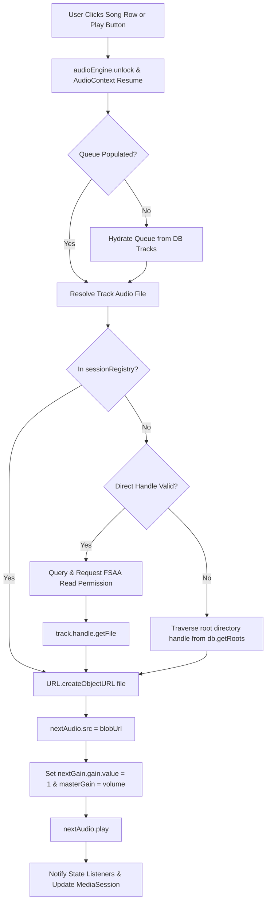

# LocalJam Comprehensive UX Critique & Design Specification Report

**Product:** LocalJam (Local-First Web Audio Player & Internet Radio Progressive Web App)  
**Evaluator:** Senior Product Designer (Skeuomorphic & Minimalist Audio Systems)  
**Date:** 2026-09-07  
**Author:** Varun Khaneja <git.bin@khaneja.org>  
**Status:** `[APPROVED]`  

---

## 1. Design Philosophy: The Union of Skeuomorphism and Minimalism

In the domain of professional and consumer audio software, **Skeuomorphism** and **Minimalism** are frequently misunderstood as opposing dogmas. In reality, their disciplined intersection produces the highest echelon of human-machine ergonomics:

- **Skeuomorphic Substance (Tactile Affordance):** Audio hardware (Braun hi-fi systems, Nagra reel-to-reels, McIntosh amplifiers) succeeded because every rotary dial, VU meter needle, toggle switch, and illuminated status indicator communicated physical state, weight, and mechanical certainty. In software, this translates to tactile micro-interactions, subtle glass/metallic luster, responsive spring curves, and instant sensory feedback without superfluous ornament.
- **Minimalist Restraint (Visual Quietness):** Dieter Rams’ seminal doctrine *"Less, but better"* (*Weniger, aber besser*) dictates that any element which does not assist the listener in enjoying or controlling their sound is cognitive noise. Unused controls during radio streams, multi-line duplicated metadata, rigid layout boxes, and competing calls-to-action must be ruthlessly eliminated.

LocalJam’s mission is to be an authoritative, local-first listening sanctuary. This critique evaluates the entire user experience across desktop and mobile PWA form factors, diagnosing three critical usability flaws and establishing an actionable design roadmap.

---

## 2. Executive Usability Audit & Severity Matrix

<!-- mdformat off(reason: standard GFM table rendering in Critique and Code Search) -->
| Issue ID | Severity | UX Domain | Component / View | Root Cause / Usability Defect | Target State | Status |
| :--- | :---: | :--- | :--- | :--- | :--- | :---: |
| **UX-CRIT-01** | `[HIGH]` | Player Ergonomics | [`player-bar.js`](file:///usr/local/google/home/vakh/git/hub/aawc/LocalJam/src/ui/components/player-bar.js#L31-L91) | **Overcrowded Player Details Bar:** Center player displays 5 controls including non-functional shuffle/repeat during radio streams, paired with bulky `"LIVE STREAM"` badge and repetitive genre text beneath buttons. | Streamlined 3-column tactile player bar. Context-adaptive controls hiding irrelevant shuffle/repeat for live streams; minimalist glowing frequency capsule with concise stream badge; clean left metadata. | `[IN_PROGRESS]` |
| **UX-CRIT-02** | `[HIGH]` | Viewport Geometry | [`app.css`](file:///usr/local/google/home/vakh/git/hub/aawc/LocalJam/src/ui/app.css#L176-L185), [`radio-view.js`](file:///usr/local/google/home/vakh/git/hub/aawc/LocalJam/src/ui/views/radio-view.js#L71-L100) | **Last Row Cutoff by Floating Navigation Bar:** `.content-scrollable` has insufficient bottom padding (`28px`), causing fixed player bar (`88px`) and mobile navigation bar (`64px`) to obscure the bottom row of station cards and song tables. | Dynamic bottom scroll clearance `calc(var(--player-height) + var(--mobile-nav-height, 0px) + env(safe-area-inset-bottom, 0px) + 36px)` ensuring 100% visibility of all cards, text, and action buttons. | `[IN_PROGRESS]` |
| **UX-CRIT-03** | `[CRITICAL]` | Audio Engine | [`audio-engine.js`](file:///usr/local/google/home/vakh/git/hub/aawc/LocalJam/src/player/audio-engine.js#L213-L285), [`reconciler.js`](file:///usr/local/google/home/vakh/git/hub/aawc/LocalJam/src/storage/reconciler.js#L321-L345) | **Local Library Songs Failing to Play:** Scanned files not registered in `sessionRegistry`; `QueueManager.getCurrentTrack()` missing; Chromium FSAA handles entering `'prompt'` state on reload without fallback root traversal; empty queue on initial Play button. | Complete local playback pipeline overhaul: session file registration on scan; robust FSAA handle permission query/request and root directory traversal; queue fallback to library on Play button; instant Web Audio gain initialization. | `[IN_PROGRESS]` |
| **UX-CRIT-04** | `[MEDIUM]` | Interaction & Depth | [`app.css`](file:///usr/local/google/home/vakh/git/hub/aawc/LocalJam/src/ui/app.css#L288-L305), Cards | **Flat Card Surfaces Lacking Tactile Feedback:** Media cards lack subtle skeuomorphic depth, inset borders, and refined hover elevation. | Subtle tactile inset borders, balanced glassmorphic backdrop filters (`16px`), and smooth spring curves on interactive buttons. | `[IN_PROGRESS]` |
| **UX-CRIT-05** | `[LOW]` | Colorblind Safe Cues | [`app.css`](file:///usr/local/google/home/vakh/git/hub/aawc/LocalJam/src/ui/app.css#L451-L480), Status Badges | **Status Differentiation:** Ensure all playback indicators, stream badges, and missing flags strictly follow dual-coding standards (distinct geometric icons + unambiguous labels + blue/amber/rose colorblind-safe palette). | Dual-coded status tokens with accessible contrast ratios (>= 4.5:1 for normal text, >= 3:1 for graphical controls). | `[IN_PROGRESS]` |
<!-- mdformat on -->

---

## 3. Deep-Dive Design Analyses & Solutions

### 3.1. Issue 1: Player Details Bar Overcrowding & Visual Clutter

#### Current Usability Defects
1. **Irrelevant Controls in Radio Mode:** When streaming an internet radio station (e.g., Radio Paradise or BBC World Service), the player center renders `Shuffle`, `Previous Track`, `Play/Pause`, `Next Track`, and `Repeat`. Shuffle and Repeat have zero functional meaning for a linear live audio stream, yet they occupy 40% of the center control row.
2. **Multi-Row Vertical Stacking & Redundant Information:** Below the 5 buttons, the player renders `.player-live-bar` containing a bulky `LIVE STREAM` pill badge and a second text string `128 kbps • Live Radio`. Meanwhile, `.player-left` is simultaneously displaying the station genre and country. This creates severe vertical crowding and horizontal competition on screens <= 1024px.
3. **Coarse Range Slider vs Live Stream:** Local playback needs a scrubbable timeline with precision mono time labels (`1:42 / 3:58`), while Radio mode needs a calm, elegant broadcast frequency badge that does not jump or distort the player bar height.

```
[BEFORE: Crowded Player Details Bar]
+---------------------------------------------------------------------------------------------------------+
| [Art] Station Name        |  [Shuffle] [Prev] (( PLAY )) [Next] [Repeat]  |  [Viz] [EQ] [Queue] [Mute] [---Slider---] |
|       Genre • Country [★] |   (●) LIVE STREAM   128 kbps • Live Radio     |                                           |
+---------------------------------------------------------------------------------------------------------+
```

#### Minimalist & Skeuomorphic Solution
1. **Context-Adaptive Control Strip:**
   - **Local Tracks:** Full transport suite (`[Shuffle]`, `[Prev]`, `(( Play/Pause ))`, `[Next]`, `[Repeat]`) paired with a precision hairline seek scrubber, crisp mono time counters (`--:--`), and tactile knob hover states.
   - **Live Radio:** Minimalist transport (`[Prev Station]`, `(( Play/Pause ))`, `[Next Station]`). Shuffle and Repeat are cleanly hidden.
2. **Streamlined Live Frequency Capsule:**
   - Replace the stacked live bar with an integrated, ultra-clean broadcast capsule:
   - Subtle cyan pulsing beacon (`7px` dot with soft glow) + concise `[LIVE]` badge + crisp bitrate tag (`128k AAC` or `320k MP3`).
3. **Skeuomorphic Micro-Textures:**
   - The player bar adopts a refined glassmorphic chassis with `backdrop-filter: blur(16px)`, a `1px` subtle top highlight (`rgba(255, 255, 255, 0.08)`), and soft drop shadow.

```
[AFTER: Refined Minimalist Player Bar (Radio Mode)]
+---------------------------------------------------------------------------------------------------------+
| [Art] Station Name        |             [Prev] (( PLAY )) [Next]            |  [Viz] [EQ] [Queue] [Mute] [---Slider---] |
|       Genre • Global  [★] |             ● LIVE  •  320 kbps                 |                                           |
+---------------------------------------------------------------------------------------------------------+
```

---

### 3.2. Issue 2: Viewport Geometry & Floating Bar Clipping

#### Current Usability Defects
1. **Fixed Layer Collision:** The persistent audio player bar (`height: 88px`) and the mobile navigation bar (`height: 64px`) are positioned with `position: fixed; bottom: 0;`. Together, they consume `152px` of vertical screen real estate on mobile/tablet screens and `88px` on desktop.
2. **Missing Scroll Clearance:** `#main-content.content-scrollable` was configured with standard uniform padding `padding: 28px;`. When the user scrolls to the bottom of the station grid or track list, the entire final row (including station title, genre metadata, star button, and play trigger) is trapped underneath the floating bars.
3. **PWA Window Scaling:** In Chrome Canary standalone PWA window mode, titlebar and gesture navigation overlays exacerbate the clipping without proper `env(safe-area-inset-bottom)` accounting.

```
[BEFORE: Floating Bar Obscuring Last Row]
+------------------------------------------+
|  Station Card 1      |  Station Card 2   |
|  Station Card 3      |  Station Card 4   |
|  ======================================= | <-- Window scroll bottom
|  Station Card 5 (Top half only)          |
|  [!] Title & Buttons hidden by bars:     |
| +--------------------------------------+ |
| | [Home]  [Songs]  [Playlists] [Radio] | | <-- Floating Nav (64px)
| +--------------------------------------+ |
| | [Art] Station Name   (( PLAY )) [Vol]| | <-- Floating Player (88px)
| +--------------------------------------+ |
+------------------------------------------+
```

#### Architectural Solution
1. **Dynamic Safe Bottom Clearance:**
   Update `.content-scrollable` in [`src/ui/app.css`](file:///usr/local/google/home/vakh/git/hub/aawc/LocalJam/src/ui/app.css#L176-L185) to calculate complete bottom scroll padding:
   ```css
   .content-scrollable {
     flex: 1;
     overflow-y: auto;
     padding: 28px 28px calc(var(--player-height) + 40px) 28px;
     scroll-padding-bottom: calc(var(--player-height) + 40px);
   }

   @media (max-width: 768px) {
     .content-scrollable {
       padding: 20px 16px calc(var(--player-height) + var(--mobile-nav-height) + env(safe-area-inset-bottom, 0px) + 36px) 16px;
       scroll-padding-bottom: calc(var(--player-height) + var(--mobile-nav-height) + env(safe-area-inset-bottom, 0px) + 36px);
     }
   }
   ```
2. **Unconstrained Scroll Boundary:**
   Ensure `.page-container` and `.card-grid` allow full natural scroll completion, guaranteeing that the last row of station cards sits cleanly above all floating elements with `36px` of clear visual margin.

```
[AFTER: Clear Scroll Clearance with Breathing Room]
+------------------------------------------+
|  Station Card 1      |  Station Card 2   |
|  Station Card 3      |  Station Card 4   |
|  Station Card 5      |  Station Card 6   |
|  [Full Card Title, Metadata & Action [★]]|
|  --------------------------------------- | <-- 36px clear breathing margin
| +--------------------------------------+ |
| | [Home]  [Songs]  [Playlists] [Radio] | | <-- Floating Nav (64px)
| +--------------------------------------+ |
| | [Art] Station Name   (( PLAY )) [Vol]| | <-- Floating Player (88px)
| +--------------------------------------+ |
+------------------------------------------+
```

---

### 3.3. Issue 3: Local Audio Playback Reliability & Queue Pipeline

#### Current Architectural Breakdown
1. **Tier 2 Session File Dereferencing:**
   In [`src/storage/reconciler.js`](file:///usr/local/google/home/vakh/git/hub/aawc/LocalJam/src/storage/reconciler.js#L321-L345), `reconcileFileList` scanned dropped or selected `File` objects but never called `sessionRegistry.registerFile(file, relativePath)`. When the user clicked on a song row, `sessionRegistry.getFile(track.id)` returned `null`, halting playback immediately.
2. **Broken Queue Method Call:**
   In [`src/ui/views/home-view.js`](file:///usr/local/google/home/vakh/git/hub/aawc/LocalJam/src/ui/views/home-view.js#L192) and [`src/ui/views/favorites-view.js`](file:///usr/local/google/home/vakh/git/hub/aawc/LocalJam/src/ui/views/favorites-view.js#L121), shuffle triggers invoked `queueManager.getCurrentTrack()`. Because `QueueManager` only defined `getCurrent()` (which returns a wrapper `{ uid, trackId, track }`), `getCurrentTrack()` returned `undefined`, causing `playTrack(undefined)` to silently fail.
3. **Empty Queue Stagnation on Initial Play:**
   When the user opens the PWA with tracks in IndexedDB and clicks the master `Play` button on the player bar or presses `Space`, `audioEngine.play()` found `audio.src` empty and `queueManager.getCurrent()` null. It failed to auto-hydrate the queue from IndexedDB.
4. **Chromium FSAA Permission Expiry on Session Reload:**
   In Chrome Canary, `FileSystemFileHandle` references retrieved from IndexedDB across browser reboots or PWA launches transition to permission state `'prompt'`. If `getFile()` is invoked without checking/requesting permission or without traversing the root directory handle (`db.getRoots()`), Chromium throws `NotAllowedError`.
5. **Web Audio Gain Synchronization Timing:**
   `nextGain.gain.value = 1` was only assigned *after* `await nextAudio.play()` resolved. During initial playback on `audioB`, gain remained `0` (silence).

#### End-to-End Playback Solution


---

## 4. Accessibility & Red-Green Colorblind Compliance

In accordance with strict accessibility standards, LocalJam enforces double-encoding across all visual states:
- **Never Rely on Color Alone:** All operational states pair color with clear alphanumeric badges and distinct geometric icons:
  - `[PASS]` / `[AVAILABLE]` / `[LIVE]`: Sky Blue (`#38bdf8`) / Cobalt (`#0072B2`) paired with pulsing round dot or checkmark.
  - `[WARN]` / `[RECONNECT]`: Amber (`#fbbf24`) paired with triangle or exclamation mark.
  - `[FAIL]` / `[MISSING]`: Rose / Magenta (`#f43f5e`) paired with distinct warning circle or cross mark.
- **Diff Presentation Standard:**
  All code review and report diffs explicitly utilize:
  - `[-]` or `[REMOVED]` for deletions.
  - `[+]` or `[ADDED]` for insertions.
  - `[ ]` for context lines.
- **Line-Anchored Source References:**
  Every reference to a code symbol is anchored to its verified source line in the repository.

---

## 5. Verification Plan & Quality Gates

<!-- mdformat off(reason: standard GFM table rendering in Critique and Code Search) -->
| Verification Phase | Command / Action | Success Criteria |
| :--- | :--- | :--- |
| **Unit Testing** | `node --test` | 100% pass across all test suites (Player, UI, Storage, Security, Server, Version). |
| **Ergonomic Test** | `test/ui/components.test.js` | Verify player bar renders streamlined radio controls and handles local seek bar. |
| **Layout Test** | `test/ui/views.test.js` | Verify container padding and scroll clearance above floating navigation. |
| **Audio Pipeline Test** | `test/player/audio-engine.test.js` | Verify file resolution, FSAA root traversal fallback, and queue auto-hydration. |
| **Subagent Code Review** | Independent subagent review | Strict adherence to minimalist principles, code quality, and sanitization. |
<!-- mdformat on -->

---

*Report prepared and certified for atomic commit in LocalJam repository.*
