# Radio Stream Resilience Architecture & Bitrate Telemetry Normalization

**Status:** Approved Architecture & Specification  
**Date:** 2026-09-25  
**Scope:** Resilient HTTP/ICY live audio stream playback, conservative dead-socket recovery, unified radio state machine, and robust bitrate display normalization in LocalJam  
**Target Modules:**  
- `src/player/audio-engine.js` (event-driven stream state machine, dead-socket debounce timer, backoff reconnection, asynchronous promise synchronization)  
- `src/ui/stage.js` (status telemetry rendering, normalized bitrate display, colorblind-safe labels/glyphs)  
- `src/radio/stations.js` / `src/ui/browse-model.js` (pure `formatBitrate(raw)` normalization utility)  
- `test/player/audio-engine.test.js` & `test/ui/stage.test.js` (automated verification suites)  

---

## 1. Executive Summary

Internet radio stations in LocalJam stream continuous MPEG (`audio/mpeg`) or AAC (`audio/aac`, `audio/aacp`) audio over HTTP/ICY protocols without predefined content lengths. In browser environments, these live streams are vulnerable to silent TCP socket termination ("dead sockets") caused by Wi-Fi roaming, cellular handoffs, NAT timeouts, and transient network drops.

This design document establishes a robust, zero-dependency resilience architecture for radio playback and eliminates telemetry formatting regressions:

1. **Zero Synthetic Polling:** Replaces timer-based `currentTime` polling loops (`setInterval`) with a native media event-driven state machine governed by standard `HTMLMediaElement` events (`waiting`, `playing`, `canplay`, `error`, `stalled`) and Window network lifecycle events (`online`, `offline`).
2. **Conservative Dead-Socket Recovery:** Implements a single 20-second debounced dead-socket timer. The timer is armed strictly when the browser enters a native `waiting` (buffering) state during active playback. If native `playing` or `canplay` events fire before expiration, the timer is disarmed immediately. Only prolonged socket death (20 continuous seconds of stall) triggers reconnection.
3. **Deterministic Exponential Backoff & Cache-Busting:** Retries up to 5 attempts (1s, 2s, 4s, 8s, 16s cap) with timestamped cache-busting query parameters (`_lj_retry=<timestamp>`), transitioning gracefully to `[OFFLINE]` error state if unrecoverable.
4. **Asynchronous Concurrency & Race-Condition Protection:** Introduces a monotonic generation token (`playbackGeneration`) to ensure that stale asynchronous promises from discarded station requests or background reconnection attempts cannot overwrite current user state or trigger phantom playback.
5. **Bitrate Display Normalization:** Implements a pure, centralized `formatBitrate(raw)` utility that correctly normalizes bare integers, raw bits-per-second values, pre-formatted strings, and codec suffixes, resolving the `"320 kbps kbps"` unit duplication defect.
6. **Red-Green Colorblind Accessibility:** Ensures 100% double-coded visual telemetry (`[LIVE]`, `[BUFFERING]`, `[CONNECTING]`, `[RECONNECTING]`, `[OFFLINE]`, `[READY]`) pairing distinct geometric glyphs (`●`, `⏳`, `▲`, `✖`) with high-contrast accessible color palettes.

---

## 2. Context & Motivation

### 2.1 Post-Mortem: Commit 7831eaa Watchdog Failure

In commit `7831eaa`, an initial attempt was made to handle stream stalls by introducing an active stall watchdog inside `src/player/audio-engine.js`. The watchdog scheduled a `setInterval` firing every 2,000ms to poll whether `activeAudio.currentTime` had advanced since the previous tick. If `currentTime` remained unchanged for 8,000ms while `isPlaying` was true, the engine classified the stream as stalled and invoked `reconnectRadioStream()`.

While unit tests with mocked timers passed, real-world deployment revealed four critical failure mechanisms:

1. **False-Positive Stall Disconnections:** Live HTTP/ICY audio streams naturally exhibit uneven data delivery over variable-latency networks. Decoders frequently process incoming audio in bursts, during which `currentTime` advancement may pause for several seconds while the browser's internal audio buffer fills. An 8-second threshold was too aggressive for international or high-latency radio streams, causing healthy streams to be forcibly aborted in mid-playback.
2. **Destructive Reconnection Cascades:** Upon detecting a perceived stall, `checkStall()` immediately invoked `reconnectRadioStream()`, which called `audio.pause()`, purged the audio source attribute, and opened a new HTTP connection with a cache-busting parameter. This destroyed the browser's existing decoded buffer and restarted network negotiation. If the new connection required more than 8 seconds to buffer initial audio packets, the watchdog fired again, trapping the player in an infinite reconnection loop.
3. **Background Tab & Timer Throttling Interference:** Modern browsers (Chromium, Firefox, WebKit) aggressively throttle `setInterval` callbacks in background tabs to conserve CPU and battery, reducing execution frequency to once per minute or suspending them entirely. When a user switched back to the LocalJam tab after background listening, the accumulated delta (`now - lastPositionUpdateTime`) instantly exceeded 8,000ms. The engine immediately terminated audio playback that had been playing without issue in the background.
4. **Desynchronization with Native Media Subsystems:** The polling loop operated out-of-band from the browser's native media pipeline, ignoring native media events (`waiting`, `canplay`, `playing`) and fighting against the browser's built-in buffer management.

Due to these regressions, commit `7831eaa` was reverted in commit `0d9fbf8`. The replacement architecture must abandon synthetic polling entirely in favor of native media event-driven state transitions paired with conservative debounce timeouts.

### 2.2 Post-Mortem: Bitrate Unit Duplication Defect

In `src/radio/stations.js`, station definitions populate the `bitrate` property with human-readable string values:

- `'320 kbps'`
- `'256 kbps'`
- `'160 kbps AAC'`
- `'96 kbps AAC'`
- `'128 kbps'`

In `src/ui/stage.js#L567`, the radio telemetry status line constructed the live label using a naive template literal:

```javascript
// Defective implementation in src/ui/stage.js:L567
label = `[LIVE] · ${bitrate || 128} kbps`;
```

This produced severe visual formatting defects across the UI:

- When `bitrate` was `'320 kbps'`, the label rendered as `"[LIVE] · 320 kbps kbps"`.
- When `bitrate` was `'160 kbps AAC'`, the label rendered as `"[LIVE] · 160 kbps AAC kbps"`.
- If a future API or custom station provided raw bits-per-second (e.g., `128000`), the label rendered as `"[LIVE] · 128000 kbps"` (an erroneous factor of 1,000).
- If `bitrate` was undefined or empty, the fallback rendered as `"[LIVE] · 128 kbps"`.

A centralized, pure normalization function is necessary to guarantee canonical formatting regardless of input data shape.

---

## 3. Design Goals & Non-Goals

### 3.1 Design Goals

- **Zero Synthetic Polling:** Eliminate all `setInterval` loops and periodic `currentTime` polling from the audio engine.
- **Native Media Event-Driven State:** Drive state transitions exclusively via standard DOM media events emitted by `HTMLAudioElement` (`waiting`, `playing`, `canplay`, `error`, `stalled`) and Window network events (`online`, `offline`).
- **Conservative Dead-Socket Recovery:** Employ a 20-second debounced dead-socket timer that arms only when the browser actively fires a `waiting` event during playback, disarming immediately upon resumed playback.
- **Deterministic Exponential Backoff:** Reconnect using exponential backoff capped at 5 attempts (1s, 2s, 4s, 8s, 16s), transitioning to an explicit `[OFFLINE]` error state upon final failure.
- **Concurrency & Race-Condition Safety:** Guarantee that rapid station switching, track transitions, or user pauses during in-flight network requests cannot leave the engine in an inconsistent state or leak audio nodes.
- **Bitrate Telemetry Normalization:** Provide a pure `formatBitrate(raw)` function handling bare numbers, raw bps, pre-formatted strings, and codec suffixes.
- **Red-Green Colorblind Accessibility:** Deliver double-coded status indicators (text tag + geometric glyph + accessible CSS color) compliant with repository standards.

### 3.2 Non-Goals

- **Client-Side Demuxing:** Not implementing WebAssembly or JavaScript-based MP3/AAC bitstream demuxers. Native `HTMLAudioElement` handles audio decoding.
- **Service Worker Request Proxying:** Not routing radio audio chunks through Service Worker `fetch` proxies, avoiding worker lifecycle suspensions and CORS complications.
- **Offline Radio Caching:** Live radio streams are real-time broadcasts; offline caching of stream audio is not supported.

---

## 4. Bitrate Normalization Architecture

### 4.1 Specification of `formatBitrate(raw)`

The normalization utility must accept diverse metadata formats and return a consistent string adhering to the pattern:

`${bitrateNumber} kbps${codecSuffix}`

#### Supported Input Variations

| Input Category | Example Input | Normalized Output | Rule Applied |
| :--- | :--- | :--- | :--- |
| **Pre-formatted string with kbps** | `'320 kbps'`, `'128kbps'` | `'320 kbps'` | Strips existing unit; re-applies standard spacing |
| **String with codec suffix** | `'160 kbps AAC'`, `'96kbps aac'` | `'160 kbps AAC'` | Preserves uppercase codec identifier |
| **Bare numeric string** | `'320'`, `'128'` | `'320 kbps'` | Appends `'kbps'` |
| **Bare integer / float** | `320`, `128` | `'320 kbps'` | Converts to integer; appends `'kbps'` |
| **Raw bits-per-second (bps)** | `128000`, `320000`, `256000` | `'128 kbps'`, `'320 kbps'` | Values `>= 10000` divided by 1000 |
| **Null / Undefined / Empty** | `null`, `undefined`, `''` | `'128 kbps'` | Canonical fallback default |
| **Malformed string** | `'unknown'`, `'high'` | `'128 kbps'` | Non-parseable inputs default to 128 kbps |

### 4.2 Interface Contract & Implementation Signature

The helper function is pure, zero-dependency, and exported for use by `src/ui/stage.js`, `src/ui/browse-model.js`, and test suites.

```javascript
/**
 * Normalizes varied bitrate representations into a canonical "N kbps [CODEC]" string.
 *
 * @param {string|number|null|undefined} raw - Raw bitrate input from metadata or catalog.
 * @returns {string} Normalized string, e.g. "320 kbps", "160 kbps AAC", or "128 kbps".
 */
export function formatBitrate(raw) {
  if (raw === null || raw === undefined || raw === '') {
    return '128 kbps';
  }

  // Handle numerical input
  if (typeof raw === 'number') {
    if (isNaN(raw) || raw <= 0) return '128 kbps';
    const kbps = raw >= 10000 ? Math.round(raw / 1000) : Math.round(raw);
    return `${kbps} kbps`;
  }

  const str = String(raw).trim();
  if (!str) return '128 kbps';

  // Extract primary numeric segment and optional trailing codec (e.g. AAC, MP3)
  const match = str.match(/^(\d+)\s*(?:k(?:bps)?)?\s*([a-zA-Z0-9+]+)?/i);
  if (!match) {
    return '128 kbps';
  }

  let num = parseInt(match[1], 10);
  if (isNaN(num) || num <= 0) return '128 kbps';

  // Convert raw bps (e.g. 128000) to kbps
  if (num >= 10000) {
    num = Math.round(num / 1000);
  }

  const codec = match[2] ? ` ${match[2].toUpperCase()}` : '';
  // Avoid duplicating if regex captured 'kbps' as codec
  if (codec.trim().toLowerCase() === 'kbps') {
    return `${num} kbps`;
  }

  return `${num} kbps${codec}`;
}
```

### 4.3 Stage Integration

In `src/ui/stage.js#L548-L579`, `renderRadioStatusLine` is updated to utilize `formatBitrate`:

```javascript
// Clean stage integration in src/ui/stage.js
import { formatBitrate } from '../radio/stations.js'; // or browse-model.js

// Within renderRadioStatusLine:
if (streamState === 'playing' && isPlaying) {
  glyph = '●';
  label = `[LIVE] · ${formatBitrate(bitrate)}`;
  colorVar = 'var(--accent-cyan)';
}
```

This ensures that regardless of whether the station defines `bitrate: '320 kbps'` or `bitrate: 320000`, the Stage consistently displays `"[LIVE] · 320 kbps"`.

---

## 5. Radio Stream State Machine

### 5.1 Comprehensive State Diagram

The lifecycle of an internet radio stream is modeled as a deterministic finite state machine with 6 mutually exclusive states:

1. `IDLE / READY`: Player at rest or paused. No network socket active.
2. `CONNECTING`: Audio source assigned; initial network handshake and `play()` promise in flight.
3. `PLAYING (LIVE)`: Active media decode; audio rendered through Web Audio / DAC.
4. `BUFFERING`: Native `waiting` event fired; 20-second debounced dead-socket timer active.
5. `RECONNECTING`: Dead-socket timer expired or recovery initiated; exponential backoff active.
6. `ERROR (OFFLINE)`: Unrecoverable network failure or maximum retries (5) exceeded.

```mermaid
stateDiagram-v2
    [*] --> IdleReady: App Launch / Cold Start

    state "IDLE / READY" as IdleReady
    state "CONNECTING" as Connecting
    state "PLAYING (LIVE)" as PlayingLive
    state "BUFFERING" as Buffering
    state "RECONNECTING" as Reconnecting
    state "ERROR (OFFLINE)" as ErrorOffline

    IdleReady --> Connecting: User selects station / Taps Play
    
    Connecting --> PlayingLive: Native 'playing' event fired
    Connecting --> ErrorOffline: Fatal network / CORS error (Web Audio & fallback fail)
    Connecting --> IdleReady: User pauses / Switches to local track

    PlayingLive --> Buffering: Native 'waiting' event (Start 20s dead-socket timer)
    PlayingLive --> IdleReady: User taps Pause / Stop
    PlayingLive --> Connecting: User switches to different radio station
    PlayingLive --> Reconnecting: Native 'error' event on active element

    Buffering --> PlayingLive: Native 'playing' or 'canplay' (Cancel 20s timer)
    Buffering --> Reconnecting: 20s dead-socket timer expires
    Buffering --> IdleReady: User taps Pause / Stop
    Buffering --> Connecting: User switches to different radio station

    Reconnecting --> Connecting: Backoff timer fires; execute connection attempt
    Reconnecting --> ErrorOffline: Max attempts (5) exceeded
    Reconnecting --> IdleReady: User taps Pause / Stop during backoff

    ErrorOffline --> Connecting: User taps Play / Selects station (Manual Retry)
    ErrorOffline --> IdleReady: User switches to local track
```



### 5.2 State Transition Matrix

Every transition is triggered by an explicit event, checked against runtime guards, and executes discrete actions:

| Source State | Event / Trigger | Guard / Condition | Action Taken | Target State | UI Glyph & Label | Palette Color & CSS Variable |
| :--- | :--- | :--- | :--- | :--- | :--- | :--- |
| **`IDLE / READY`** | User calls `playRadio(station)` | Valid station URL | Increment `playbackGeneration`; reset retry counter; set `isRadio = true`; assign `src`; invoke `play()` | **`CONNECTING`** | `▲` `[CONNECTING]` | `var(--accent-amber)` (`#fbbf24`) |
| **`CONNECTING`** | Native `playing` event | Current token matches `playbackGeneration` | Disarm retry timers; reset `reconnectAttempts = 0`; set `isPlaying = true` | **`PLAYING (LIVE)`** | `●` `[LIVE] · <bitrate>` | `var(--accent-cyan)` (`#38bdf8`) |
| **`CONNECTING`** | Native `error` event / Promise rejection | Both Web Audio and fallback fail; attempts `< 5` | Schedule backoff retry; increment `reconnectAttempts` | **`RECONNECTING`** | `▲` `[RECONNECTING]` | `var(--accent-amber)` (`#fbbf24`) |
| **`CONNECTING`** | Native `error` event | `reconnectAttempts >= 5` | Clear timers; teardown audio element; notify toast `[STREAM OFFLINE]` | **`ERROR (OFFLINE)`** | `✖` `[OFFLINE]` | `var(--accent-rose)` (`#f43f5e`) |
| **`CONNECTING`** | User calls `pause()` or `stop()` | User intent | Pause audio elements; increment `playbackGeneration`; clear timers | **`IDLE / READY`** | `●` `[READY]` | `var(--text-secondary)` (`#94a3b8`) |
| **`PLAYING (LIVE)`** | Native `waiting` event | `isPlaying === true` | Start 20-second debounced dead-socket timer (`deadSocketTimer`) | **`BUFFERING`** | `⏳` `[BUFFERING]` | `var(--accent-amber)` (`#fbbf24`) |
| **`PLAYING (LIVE)`** | Native `error` event | Network socket aborted | Trigger immediate reconnection (`immediate: true`) | **`RECONNECTING`** | `▲` `[RECONNECTING]` | `var(--accent-amber)` (`#fbbf24`) |
| **`PLAYING (LIVE)`** | User calls `pause()` | User intent | Pause element; disarm dead-socket timer; set `isPlaying = false` | **`IDLE / READY`** | `●` `[READY]` | `var(--text-secondary)` (`#94a3b8`) |
| **`PLAYING (LIVE)`** | User calls `playTrack(track)` | Source toggle | Teardown radio; revoke stream; switch to local pipeline | **`IDLE / READY`** | N/A (Switches to Local UI) | Standard Track UI |
| **`BUFFERING`** | Native `playing` or `canplay` | Stream recovered within 20s | Disarm and clear `deadSocketTimer`; reset `reconnectAttempts = 0` | **`PLAYING (LIVE)`** | `●` `[LIVE] · <bitrate>` | `var(--accent-cyan)` (`#38bdf8`) |
| **`BUFFERING`** | `deadSocketTimer` expires (20s) | Continuous stall for 20s | Increment `reconnectAttempts`; apply cache-busting URL; schedule retry | **`RECONNECTING`** | `▲` `[RECONNECTING]` | `var(--accent-amber)` (`#fbbf24`) |
| **`BUFFERING`** | User calls `pause()` or `stop()` | User intent | Clear `deadSocketTimer`; pause element; set `isPlaying = false` | **`IDLE / READY`** | `●` `[READY]` | `var(--text-secondary)` (`#94a3b8`) |
| **`RECONNECTING`** | Backoff timer expires | `attempts < 5` & token valid | Assign cache-busting URL (`_lj_retry=<ts>`); call `audio.play()` | **`CONNECTING`** | `▲` `[CONNECTING]` | `var(--accent-amber)` (`#fbbf24`) |
| **`RECONNECTING`** | Failure after attempt 5 | `attempts >= 5` | Clear retry timer; unload audio; set `isPlaying = false`; dispatch toast | **`ERROR (OFFLINE)`** | `✖` `[OFFLINE]` | `var(--accent-rose)` (`#f43f5e`) |
| **`RECONNECTING`** | Window `offline` event | Network lost | Pause retry timer; retain attempt counter | **`RECONNECTING`** | `▲` `[RECONNECTING]` | `var(--accent-amber)` (`#fbbf24`) |
| **`RECONNECTING`** | Window `online` event | Network restored | Trigger immediate reconnect attempt (`force: true, immediate: true`) | **`CONNECTING`** | `▲` `[CONNECTING]` | `var(--accent-amber)` (`#fbbf24`) |
| **`ERROR (OFFLINE)`** | User calls `play()` / selects station | User intent | Reset `reconnectAttempts = 0`; invoke `playRadio(station)` | **`CONNECTING`** | `▲` `[CONNECTING]` | `var(--accent-amber)` (`#fbbf24`) |

---

## 6. Event Handling Semantics & Concurrency Protection

### 6.1 Native Media Event Listeners

Audio elements (`audioA`, `audioB`, `radioAudio`) in `src/player/audio-engine.js#L56-L140` bind strictly to standard DOM media events:

1. **`waiting` Event:**
   - Emitted by the browser when playback has stopped because the next frame of audio is not available.
   - Action: If `this.isRadio && this.isPlaying`, transition `this.streamState = 'buffering'`. Arm the 20-second debounced dead-socket timer. Do NOT tear down the audio pipeline immediately.
2. **`playing` Event:**
   - Emitted when audio playback has commenced or resumed after buffering.
   - Action: Disarm and clear `this.deadSocketTimer`. Reset `this.reconnectAttempts = 0`. Transition `this.streamState = 'playing'`.
3. **`canplay` Event:**
   - Emitted when the browser estimates that enough audio data has buffered to begin playback.
   - Action: Disarm `this.deadSocketTimer`. If `this.isPlaying`, transition `this.streamState = 'playing'`.
4. **`error` Event:**
   - Emitted when a media error occurs (`MediaError.MEDIA_ERR_NETWORK`, `MEDIA_ERR_DECODE`, `MEDIA_ERR_SRC_NOT_SUPPORTED`).
   - Action: If Web Audio is active, attempt direct unrouted fallback via `radioAudio`. If fallback also errors or is already active, invoke `reconnectRadioStream()`.
5. **`stalled` Event:**
   - Emitted when the browser is attempting to fetch data, but data is not unexpectedly forth-coming.
   - Action: Record internal diagnostic telemetry; do NOT force reconnect. The `waiting` event and 20s timer govern recovery.

### 6.2 Window Network Lifecycle Events

To handle device roaming (e.g., leaving home Wi-Fi and transitioning to mobile cellular):

- **`window.addEventListener('offline', ...)`:**
  - When the browser loses network connectivity (`navigator.onLine === false`), active stream sockets are severed.
  - Action: Transition `this.streamState = 'buffering'`. Pause pending reconnection backoff timers to prevent wasting retries against a dead interface.
- **`window.addEventListener('online', ...)`:**
  - When network connectivity is restored.
  - Action: If `this.isRadio && this.isPlaying && this.streamState !== 'error'`, immediately initiate reconnection (`reconnectRadioStream({ force: true, immediate: true })`). If the stream was deliberately in `'error'` state before going offline, do not auto-reconnect without user intervention.

### 6.3 The 20-Second Debounced Dead-Socket Timer

TCP sockets in live HTTP streaming may become "half-open" where the server terminates transmission without sending a TCP RST or FIN packet. The browser media pipeline waits indefinitely in an underrun state.

- **Debounce Threshold:** Exactly 20,000ms (20 seconds).
- **Arming:**
  ```javascript
  startDeadSocketTimer() {
    this.clearDeadSocketTimer();
    this.deadSocketTimer = setTimeout(() => {
      if (this.isRadio && this.isPlaying && this.streamState === 'buffering') {
        console.warn('[AudioEngine] Dead socket detected (buffered >20s). Reconnecting...');
        this.reconnectRadioStream({ immediate: true });
      }
    }, 20000);
    if (typeof this.deadSocketTimer?.unref === 'function') {
      this.deadSocketTimer.unref();
    }
  }
  ```
- **Disarming:** Invoked immediately whenever `playing`, `canplay`, `pause()`, `stop()`, or station switching occurs.

### 6.4 Concurrency Guards & Generation Token

Asynchronous audio operations (`audio.play()`, `fetch()`, `setTimeout`) can resolve out-of-order when users rapidly click between stations or pause during network negotiation.

To eliminate race conditions:

1. **Generation Counter:** `this.playbackGeneration = 0;`
2. **Increment on Intent:** Every invocation of `playRadio()`, `playTrack()`, `pause()`, or `stop()` executes `this.playbackGeneration++`.
3. **Promise Boundary Check:**
   ```javascript
   const currentGen = ++this.playbackGeneration;
   try {
     const playPromise = audio.play();
     if (playPromise !== undefined) await playPromise;
     // Verify that user intent has not changed during await
     if (this.playbackGeneration !== currentGen) {
       audio.pause();
       return;
     }
     this.streamState = 'playing';
     this.notifyState();
   } catch (err) {
     if (this.playbackGeneration !== currentGen) return;
     // Handle error...
   }
   ```
4. **Immediate Teardown on User Pause:** If a user pauses while a backoff retry timer is pending, the timer is cleared immediately, resetting `this.reconnectAttempts = 0` and setting `this.streamState = 'idle'`.

---

## 7. Alternatives Considered & Technical Trade-offs

| Criterion | Alternative A: Native HTMLAudioElement (Chosen) | Alternative B: Service Worker Stream Proxy | Alternative C: MSE + JS Stream Demuxer |
| :--- | :--- | :--- | :--- |
| **Architecture** | Native browser media element decoding with direct URL connection and Web Audio crossfade / CORS fallback. | Intercept stream fetch requests via Service Worker; forward stream chunks via `ReadableStream`. | Fetch raw byte stream; demux MP3/AAC frames in JavaScript/Wasm; append to `MediaSource` buffer. |
| **External Dependencies** | **Zero dependencies** (built-in HTML5 Audio API). | **Zero dependencies** (Service Worker standard). | **High dependency bloat** (requires custom demuxer or 150KB+ third-party library like mux.js). |
| **Battery & CPU Impact** | **Minimal** (hardware-accelerated audio decoding in dedicated browser audio thread). | **Moderate to High** (Service Worker kept awake continuously processing stream chunks). | **Severe** (continuous JavaScript main-thread/worker decoding and memory churn). |
| **Browser Compatibility** | **Universal** (100% across Chromium, Safari, Firefox, iOS, Android). | **Fragmented** (Safari iOS Service Worker streaming fetch has severe lifetime bugs). | **Restricted** (MSE for pure audio MP3/AAC is inconsistently supported across mobile Safari). |
| **Dead-Socket Handling** | Event-driven: 20s debounced timer on native `waiting` event. | Fetch stream cancel and re-request within Service Worker. | Custom frame-counter timeout in JavaScript buffer feeder. |
| **Failure Modes** | Browser-managed audio pipeline; black-box buffering. | Worker killed after 30s idle; complex request lifecycle and CORS headaches. | SourceBuffer `QuotaExceededError`; memory leaks; buffer gap decoding stalls. |
| **Decision & Rationale** | **Adopted.** Aligns directly with LocalJam's minimalist, zero-dependency, local-first ethos. | **Rejected.** Service Worker lifecycle unpredictability introduces unacceptable playback drops. | **Rejected.** Violates zero-dependency mandate and introduces high CPU/memory overhead. |

---

## 8. Implementation Specifications

### 8.1 File Modifications & Responsibilities

1. **`src/radio/stations.js` / `src/ui/browse-model.js`:**
   - Export pure `formatBitrate(raw)` function.
   - Unit test coverage for all input permutations.
2. **`src/ui/stage.js#L548-L579`:**
   - Import `formatBitrate`.
   - Update `renderRadioStatusLine(streamState, isPlaying, bitrate)`:
     - Apply `formatBitrate(bitrate)` to format the `[LIVE]` telemetry line.
     - Add explicit handling for `reconnecting` state: glyph `▲`, label `[RECONNECTING]`, color `var(--accent-amber)`.
     - Maintain strict colorblind-safe labels and glyphs.
3. **`src/player/audio-engine.js`:**
   - Add state tracking properties:
     - `this.deadSocketTimer = null;`
     - `this.reconnectTimer = null;`
     - `this.reconnectAttempts = 0;`
     - `this.maxReconnectAttempts = 5;`
     - `this.playbackGeneration = 0;`
   - Implement `startDeadSocketTimer()` and `clearDeadSocketTimer()`.
   - Implement `reconnectRadioStream({ force = false, immediate = false } = {})`.
   - Bind `waiting` event on audio elements to trigger `startDeadSocketTimer()`.
   - Bind `playing` and `canplay` events to trigger `clearDeadSocketTimer()` and reset reconnect counter.
   - Bind `online` and `offline` window event handlers.
   - Update `stop()` at `src/player/audio-engine.js#L658-L675` to clear all timers and reset reconnect attempts.

### 8.2 Clean Code Scaffolding: Reconnection & Backoff

```javascript
// Illustrative helper contract for src/player/audio-engine.js
getRetryStreamUrl(url, timestamp = Date.now()) {
  if (!url) return '';
  const separator = url.includes('?') ? '&' : '?';
  return `${url}${separator}_lj_retry=${timestamp}`;
}

async reconnectRadioStream({ force = false, immediate = false } = {}) {
  if (!this.isRadio || !this.currentStation) return;

  if (typeof navigator !== 'undefined' && navigator.onLine === false) {
    this.streamState = 'buffering';
    this.notifyState();
    return;
  }

  if (this.reconnectAttempts >= this.maxReconnectAttempts && !force) {
    this.streamState = 'error';
    this.isPlaying = false;
    this.clearDeadSocketTimer();
    this.clearReconnectTimer();
    this.notifyState();
    return;
  }

  this.reconnectAttempts++;
  this.streamState = 'reconnecting';
  this.notifyState();

  const delay = immediate ? 0 : Math.min(16000, 1000 * Math.pow(2, this.reconnectAttempts - 1));
  this.clearReconnectTimer();

  const currentGen = ++this.playbackGeneration;
  this.reconnectTimer = setTimeout(async () => {
    if (this.playbackGeneration !== currentGen || !this.isPlaying || !this.isRadio) return;
    const baseStreamUrl = this.currentStation.streamUrl || this.currentStation.url;
    const retryUrl = this.getRetryStreamUrl(baseStreamUrl);
    try {
      await this.executeStreamPlayback(this.currentStation, retryUrl);
    } catch (_) {
      if (this.playbackGeneration === currentGen) {
        this.reconnectRadioStream({ immediate: false });
      }
    }
  }, delay);
}
```

---

## 9. Verification & Testing Strategy

Verification uses Node.js 22 built-in test runner (`node --test`) without external testing libraries.

### 9.1 Bitrate Normalization Test Suite (`test/ui/format-bitrate.test.js`)

Validate that `formatBitrate` correctly transforms all documented inputs:

```javascript
// Test Matrix for formatBitrate
it('normalizes pre-formatted kbps strings', () => {
  assert.equal(formatBitrate('320 kbps'), '320 kbps');
  assert.equal(formatBitrate('128kbps'), '128 kbps');
});

it('preserves codec suffixes while normalizing units', () => {
  assert.equal(formatBitrate('160 kbps AAC'), '160 kbps AAC');
  assert.equal(formatBitrate('96kbps aac'), '96 kbps AAC');
});

it('converts raw bits-per-second values >= 10000', () => {
  assert.equal(formatBitrate(128000), '128 kbps');
  assert.equal(formatBitrate(320000), '320 kbps');
});

it('handles bare numbers and numeric strings', () => {
  assert.equal(formatBitrate(320), '320 kbps');
  assert.equal(formatBitrate('256'), '256 kbps');
});

it('safely falls back on null, undefined, or invalid inputs', () => {
  assert.equal(formatBitrate(null), '128 kbps');
  assert.equal(formatBitrate(undefined), '128 kbps');
  assert.equal(formatBitrate(''), '128 kbps');
});
```

### 9.2 Radio Stream Resilience Test Suite (`test/player/audio-engine.test.js`)

1. **State Machine Transition Verification:**
   - Confirm `playRadio(station)` transitions from `idle` to `connecting`.
   - Confirm native `playing` event transitions from `connecting` to `playing`.
   - Confirm native `waiting` event transitions from `playing` to `buffering`.
   - Confirm native `canplay` or `playing` restores `buffering` to `playing`.
2. **20-Second Debounced Dead-Socket Timer:**
   - Verify timer is armed upon `waiting` event.
   - Verify timer is cleared if `playing` fires at 5 seconds.
   - Verify timer triggers `reconnectRadioStream` if 20 continuous seconds elapse.
3. **Exponential Backoff & Cache-Busting:**
   - Verify attempt sequence: Attempt 1 (immediate), Attempt 2 (1s), Attempt 3 (2s), Attempt 4 (4s), Attempt 5 (8s).
   - Verify that stream URL contains `_lj_retry=<timestamp>`.
   - Verify transition to `error` (`[OFFLINE]`) after 5 failed attempts.
4. **Network Event Handlers:**
   - Verify window `offline` event halts active retry timers and sets `buffering`.
   - Verify window `online` event triggers immediate reconnection when player was active.
   - Verify window `online` event does NOT auto-reconnect if player was in explicit `error` state.
5. **Race-Condition & Generation Token Protection:**
   - Verify user `pause()` cancels pending reconnection timer and prevents late `play()` resolution.
   - Verify switching stations during in-flight backoff timer immediately resets attempts and cancels previous timer.
6. **Teardown & Cleanup:**
   - Verify `engine.stop()` clears all active timers (`deadSocketTimer`, `reconnectTimer`) and resets `reconnectAttempts`.

### 9.3 Red-Green Colorblind Accessibility Audit

Verify compliance with repository colorblindness guidelines:

- **Double Encoding:** Every status line renders both a distinct textual label (`[LIVE]`, `[BUFFERING]`, `[CONNECTING]`, `[RECONNECTING]`, `[OFFLINE]`, `[READY]`) and a unique geometric glyph (`●`, `⏳`, `▲`, `✖`).
- **Accessible Palette Mapping:**
  - `[LIVE]`: Cyan / Sky Blue (`#38bdf8` / `#0072B2`).
  - `[BUFFERING]`, `[CONNECTING]`, `[RECONNECTING]`: Amber / Orange (`#fbbf24` / `#D55E00`).
  - `[OFFLINE]`: Rose / Magenta (`#f43f5e` / `#CC79A7`).
  - `[READY]`: Slate Gray (`#94a3b8`).
- **No Color-Only Cues:** Color is never the sole differentiator for stream state. Text content is readable by screen readers and distinguishable on monochrome displays.
