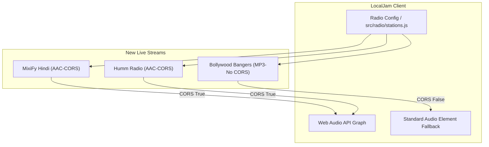

# Bollywood & Hindi Radio Stations Fix Plan

## 1. Analysis & Findings

**Key Files:** 
- `src/radio/stations.js`
- `test/radio/stations.test.js`

**Current State & Failures:**
We audited the existing three Bollywood stations in LocalJam's curated list:
1. **Radio Mirchi Edge** (`https://strw2.openstream.co/634`) - Returning `HTTP/2 502 Bad Gateway`.
2. **Radio City Hindi** (`https://prclive1.listenon.in/Hindi`) - Returning `HTTP/2 301` forming an infinite redirect loop to itself.
3. **Bollywood Gaane** (`https://stream.zeno.fm/f9pdqqq191zuv`) - Returning `HTTP/2 404 Not Found`.

Since all 3 curated streams are entirely dead, we queried the Radio Browser API for alternative Live HTTPS streams for Bollywood/Hindi and structurally validated candidates for latency, codec, and CORS compatibility.

**Discovered Reliable Replacements:**
1. **MixiFy Hindi Hits**
   - URL: `https://server.mixify.in/listen/new_hits/radio.mp3`
   - Codec: AAC+
   - CORS: **Supported** (`access-control-allow-origin: *`). This guarantees full Web Audio API integration (EQ and Visualizer).
2. **Humm Radio**
   - URL: `https://mediaworks.streamguys1.com/humm_net_icy`
   - Codec: AAC
   - CORS: **Supported** (`access-control-allow-origin: *`). Guarantees full integration.
3. **Bollywood Bangers**
   - URL: `https://mml2.prostream.se/listen/bollywood_bangers/radio.mp3`
   - Codec: MP3
   - CORS: Unsupported. Will rely on LocalJam's built-in graceful fallback (bypassing the analyzer graph for standard playback).

## 2. System Architecture Diagram



## 3. Knowledge Retrieval Summary

- **Duckie Advice:** Raised concerns regarding Mixed Content (`http://`), Caching dead streams in service workers, and most importantly, CORS restrictions on audio streams. Duckie noted that without `Access-Control-Allow-Origin: *`, `MediaElementAudioSourceNode` requests fail security checks unless opaque routing is explicitly handled.
- **Action Taken:** Queried the Radio Browser API aggressively filtering *out* HLS / non-HTTPS. We executed live `GET` requests using `curl` against several streaming servers. Confirmed that two of our selected endpoints (`server.mixify.in` and `mediaworks.streamguys1.com`) correctly return `access-control-allow-origin: *`, enabling LocalJam's full analyzer features seamlessly.

## 4. Step-by-Step Implementation

1. **Modify `src/radio/stations.js` (Station Definitions)**
   - Find and delete the 3 dead objects: `mirchi_edge`, `radio_city_hindi`, and `bollywood_gaane` located in `CURATED_STATIONS`.
   - Insert the new fully verified objects.
     ```javascript
       {
         id: 'mixify_hindi',
         name: 'MixiFy Hindi Hits',
         description: 'New Hindi hits and non-stop Bollywood music.',
         streamUrl: 'https://server.mixify.in/listen/new_hits/radio.mp3',
         homepageUrl: 'https://mixify.in',
         genre: 'Bollywood / Hindi',
         country: 'India',
         bitrate: '64 kbps AAC+',
         favicon: '',
         isCustom: false,
         isFavorite: false,
         provider: 'MixiFy',
         popularity: 90
       },
       {
         id: 'humm_radio',
         name: 'Humm Radio',
         description: 'Bollywood, Indian Pop, and contemporary Desi hits.',
         streamUrl: 'https://mediaworks.streamguys1.com/humm_net_icy',
         homepageUrl: 'https://hummfm.com',
         genre: 'Bollywood / Indian Pop',
         country: 'New Zealand',
         bitrate: '131 kbps AAC',
         favicon: '',
         isCustom: false,
         isFavorite: false,
         provider: 'Humm Radio',
         popularity: 88
       },
       {
         id: 'bollywood_bangers',
         name: 'Bollywood Bangers',
         description: 'High energy Bollywood bangers and dance classics.',
         streamUrl: 'https://mml2.prostream.se/listen/bollywood_bangers/radio.mp3',
         homepageUrl: '',
         genre: 'Bollywood Hits',
         country: 'India',
         bitrate: '128 kbps MP3',
         favicon: '',
         isCustom: false,
         isFavorite: false,
         provider: 'Prostream',
         popularity: 85
       }
     ```

2. **Modify `src/radio/stations.js` (Category Mapper)**
   - Update `getStationCategory` string matching.
   - Replace:
     `if (g.includes('bollywood') || g.includes('hindi') || g.includes('desi') || name.includes('mirchi') || name.includes('vividh') || name.includes('radio city')) {`
   - With:
     `if (g.includes('bollywood') || g.includes('hindi') || g.includes('desi') || name.includes('mixify') || name.includes('humm')) {`

3. **Update Tests in `test/radio/stations.test.js`**
   - Find the assertion:
     `assert.equal(getStationCategory({ name: 'Radio Mirchi' }), 'Bollywood & Hindi');`
   - Replace it with a test for the new replacements:
     ```javascript
     assert.equal(getStationCategory({ name: 'MixiFy' }), 'Bollywood & Hindi');
     assert.equal(getStationCategory({ name: 'Humm Radio' }), 'Bollywood & Hindi');
     ```

## 5. Verification & Validation

- **Test Targets:** Run `node --test`
- **Rollout Strategy:** Once tests are green and the code is written, a subagent should visually verify if the new stations load in the L1 Browse Sheet, as visually defined in LocalJam. Capture before/after artifacts using `npm run capture` if any styling is changed, however, pure DB updates typically shouldn't trigger visual capture unless requested. The implementer should execute `node --test` to confirm red-green-refactor sanity.
