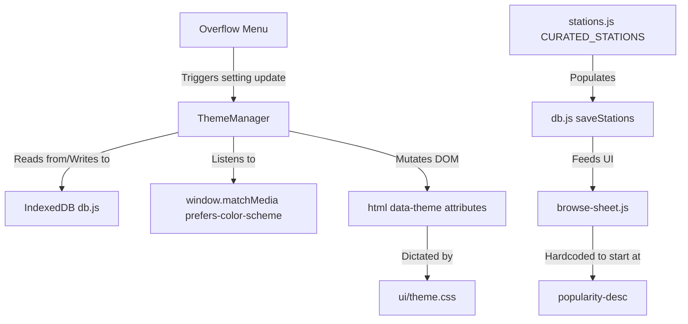

# LocalJam: Theme, Radio Station, & Sort Implementation Plan

## Pre-Flight Check / Workspace Verification

1. **Status**: Run `git status` to inspect existing experimental files or uncommitted changes.
2. **Workspace**: Verify the current branch/workspace is correct (e.g., `main` or specific feature branch).
3. **Workspace Safety**: Inspect modified or untracked files. NEVER revert or delete uncommitted files without explicit user confirmation. Isolate conflicting artifacts safely by staging or stashing as necessary.

## 1. Analysis & Findings

- **Key Files**: 
  - `./src/ui/theme.css`: Current base tokens which contain hard-coded values serving a dark-exclusive theme structure.
  - `./src/ui/components/overflow-menu.js`: Controls setting components.
  - `./src/radio/stations.js`: Holds explicit lists (`CURATED_STATIONS`) of hardcoded stations.
  - `./src/ui/components/browse-sheet.js`: Handles default sorting settings (currently defaults to custom `default` rather than popularity).
  - `./src/storage/db.js`: IndexedDB engine with existing `getSetting`, `setSetting` primitives ready for async theme preference consumption.
- **Design Patterns**: 
  - Vanilla JS ES modules.
  - Media queries and fallback handling for native APIs. 
  - Dual-coded (iconography/text labels `[PASS]`, `[FAIL]`) for visual accessibility compliance.

## 2. System Architecture Diagram

## 3. Knowledge Retrieval Summary

- **Advice from Duckie (Theming)**: Warned about Flash of Unstyled Content (FOUC). Advised utilizing standard variables, `color-scheme: light dark`, and semantic naming (e.g., `--bg-primary` instead of physical labels). Cautioned against over-engineering auto functionality via JS when CSS media queries handle it cleanly natively.
- **Advice from Duckie (Metadata & Parsing)**: No official Google vanilla JS library exists for parsing legacy string metadata; stick to custom ICY interpretation or existing vanilla implementations as planned.
- **Action Taken**: 
  - Implementing `color-scheme` into `./src/ui/theme.css`.
  - Retaining LocalJam's IndexedDB `db.js` strategy; however, due to strict CSP preventing blocking inline scripts, a fast-boot JS initialization in `./src/ui/theme.js` imported directly by `main.js` will resolve preferences asynchronously but early enough in the DOM rendering cycle to limit painting conflicts.
  - Semantic variable definitions already mapped to base tokens. 

## 4. Step-by-Step Implementation

### Task 1: Bollywood/Hindi Radio Stations & Default Sort (To be executed by Implementer)

- **Target:** `./src/radio/stations.js`, `./src/ui/components/browse-sheet.js`
- **Verification Target:** `./test/radio/stations.test.js`, `./test/ui/browse-sheet.test.js`

1. **Audit**: Trace existing radio logic to verify where genres map inside `getStationCategory`.
2. **RED**: Add assertions in tests specifying default `popularity-desc` in `browse-sheet.test.js` should occur upon DOM startup, and asserting Hindi inclusion in `stations.test.js`.
3. **GREEN**: 
   - Append reliable Hindi streams (e.g., Radio Mirchi, Radio City, or Vividh Bharati representations) manually to `CURATED_STATIONS` in `./src/radio/stations.js`.
   - Update `let radioSort = 'default';` to `let radioSort = 'popularity-desc';` within `./src/ui/components/browse-sheet.js`.
4. **Verification**: 
   - Execute `node --test`

### Task 2: Theme Persistence Engine (To be executed by Implementer)

- **Target:** `./src/ui/theme.js` (NEW), `./src/main.js`
- **Verification Target:** `./test/ui/theme.test.js` (NEW)

1. **Audit**: Validate `db.getSetting('theme')` compatibility. 
2. **RED**: Formulate `theme.test.js` verifying the state machine (resolving `auto`, loading from IDB, mounting correct `data-theme`). Use concrete inputs. 
3. **GREEN**: 
   - Develop `./src/ui/theme.js` to expose an `initTheme(db)` function that loads setting or defaults to `auto`, attaches a `matchMedia('(prefers-color-scheme: dark)')` listener and flips `document.documentElement.setAttribute('data-theme', ...)` immediately. Export a `setTheme(theme)` utility. 
   - Mount `initTheme(db)` into `./src/main.js` after IDB loads.
4. **Verification**: 
   - Execute `node --test test/ui/theme.test.js`

### Task 3: Theme Styles & Integration Details (To be executed by Implementer)

- **Target:** `./src/ui/theme.css`, `./src/ui/components/overflow-menu.js`
- **Verification Target:** `./test/ui/overflow-menu.test.js`

1. **Audit**: Analyze variable injection layers in `theme.css`.
2. **Visual Capture**: Prior to modifying UI layout, execute `npm run capture -- --feature=theme --phase=before` to take visual baseline of application.
3. **RED**: Check `overflow-menu.test.js` attempting to mount Theme UI selector buttons. Ensures failure state prior to logic addition. 
4. **GREEN**: 
   - In `./src/ui/theme.css`, add `color-scheme: light dark;` onto `:root`. Abstract deep backgrounds into `html[data-theme="light"] { ... }` preserving Blue (`#0072B2`) & Orange (`#D55E00`) accent fidelity alongside explicit visual dual-coded patterns.
   - Refactor `./src/ui/components/overflow-menu.js` HTML render string yielding a semantic button triggering `setTheme()` callbacks. Cycles sequentially through `AUTO` -> `DARK` -> `LIGHT`. Ensures label representation is `[THEME: AUTO]`, `[THEME: DARK]`, etc., conforming strictly to Red-Green accessibility matrices.
5. **Verification & Validation**:
   - `node --test test/ui/overflow-menu.test.js`
   - Capture post-deployment visuals via `npm run capture -- --feature=theme --phase=after`
